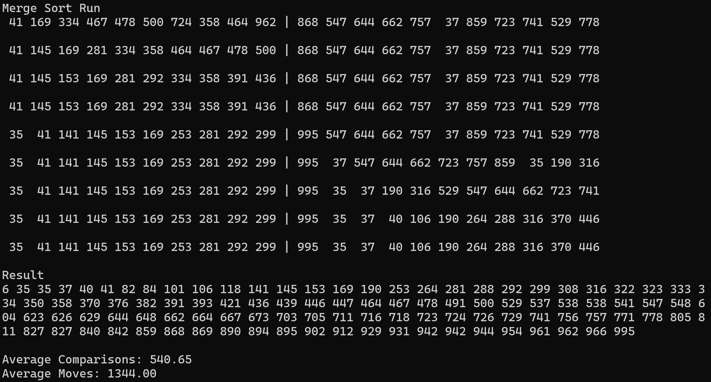

[재귀적 방식]
장점
1. 간결하고 직관적이다
단점 
1. 재귀 호출마다 함수 호출 스택이 쌓여 추가 공간 소비
2. 데이터 크기가 크다면 스택 오버플로우 발생 가능성
3. 호출마다 함수 매개변수 전달 및 스택에 상태 저장이 이루어져 반복적 방식보다 실행시간이 더 거릴 수 있음

[반복적 방식]
장점
1. 함수 호출 없이 루프를 사용하므로 스택 메모리를 사용하지 않음
2. 스택 오버플로 문제가 없어 입력 크기에 제한이 없음
3. 재귀호출에 따른 오버헤드가 발생하지 않아 실행시간 감소
단점
1. 코드가 길어지고 가독성이 떨어져 복잡도가 상승
2. 점진적인 병합 방식의 난이도
