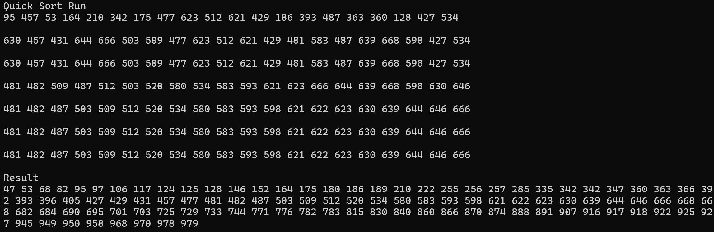

성능비교에 있어 각 정렬 알고리즘마다 평균 시간 복잡도는 아래와 같습니다

선택 정렬 : O(n²)	
삽입 정렬 : O(n²)	
버블 정렬 : O(n²)	
쉘   정렬 : O(n^(1.5))
합병 정렬 : O(n log n)
퀵   정렬 : O(n log n)

위와 같이 시간복잡도에서 퀵 정렬이 평균적으로 가장 빠르고 효율적이나,
정렬이 이미 되어 있는 정렬에서나 피벗이 비효율적으로 선택되다면 성능이 O(n²)로 떨어질 수도 있습니다.
따라서, 가장 빠른 퀵 정렬의 효율을 내기 위해서는 피벗 선택이 가장 중요한 포인트입니다.
