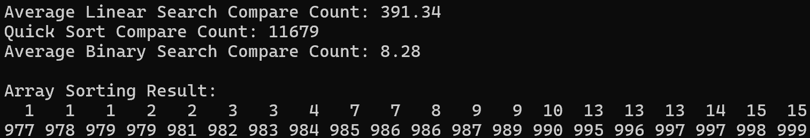
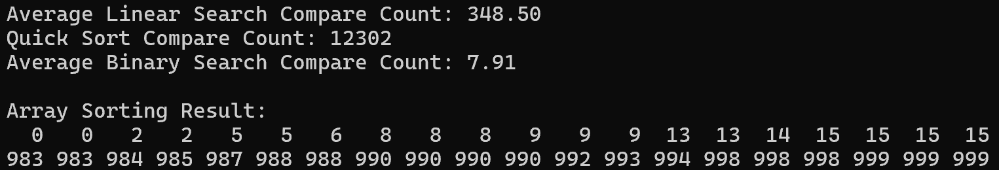
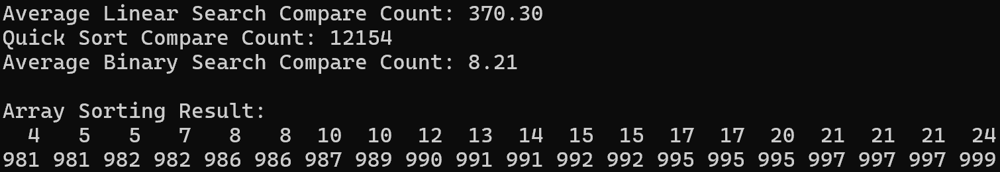

순차탐색은 배열의 정렬 여부와 상관없이 배열을 하나씩 데이터를 확인하며 목표값을 찾고,
이진탐색은 배열이 정렬된 상태를 전제로 하기에 탐색 과정에서 배열의 중간값과 목표값을 비교하며, 탐색 범위를 절반로 줄이는 방식을 사용하기 때문입니다.

따라서 정렬된 데이터의 구조를 활용해 탐색 범위를 빠르게 줄여나가는 이진탐색과 달리 정렬 상태를 활용하지 못하고 단순 반복탐색을 수행하므로 비교횟수가 많을 수 밖에 없습니다.
